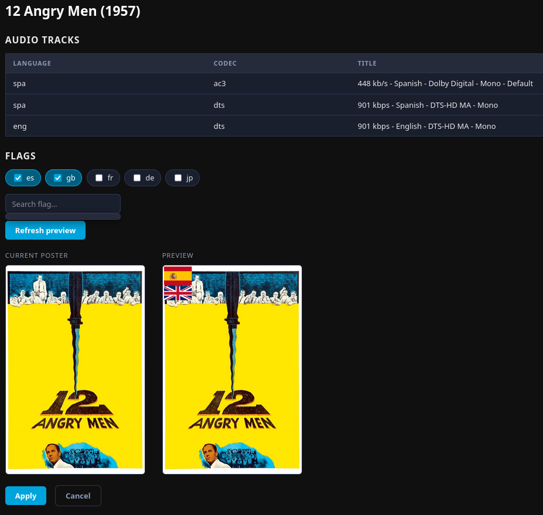
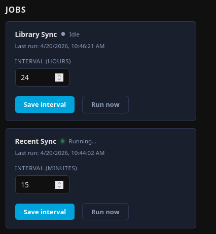

# Jellyfin Flag Setter

This is an experimental flag setter for jellyfin posters.

### Current known issues
- The jobs are 'too aggressive' and might kill responsiveness of the server while running

# 🤖 Disclaimer

This project was 100% vibecoded using Claude Code with Sonnet 4.6 & Opus 4.7.

I am a full time back-end developper and I wanted to see how far these tools have come.

# Project Info



It features:

- Automatic mapping from Audio metadata to flags (Still Work in Progress)
- A local database that keeps track of edited files
- Metadata to actually know if the file was edited or not
- Two sync jobs (Recently added / Full Scan)

----

## Jobs



### Library Sync
This is a job that runs once every 24h and fetches all images to update their status

### Recent Sync
The recent sync job runs by default every 15 minutes to scan for recently added media

------------

# Deployment

The recommended way of running it is with docker. (Specially, docker-compose)

`docker-compose.yml`

```
services:
  jellyfin-flag-setter:
    image: ghcr.io/pabsilon/jellyfin-flag-setter:latest
    restart: unless-stopped
    ports:
      - 8000:8000
    env_file: .env
    volumes:
      - .:/app/data
networks: {}
```

`.env` file

```
JELLYFIN_URL=http://your-jellyfin-host:8096
JELLYFIN_API_KEY=your_api_key_here

# Generate with: python -c "import secrets; print(secrets.token_hex(32))"
SECRET_KEY=your_secret_key_here

# Path to the SQLite database file (Don't change it)
DB_PATH=data/flagsetter.db
```

On first startup, it will run a job to fetch all the libraries in your server. It might take a while depending on the size of your library.

Once the job is ready, the first setup will ask you to create a user and password.
